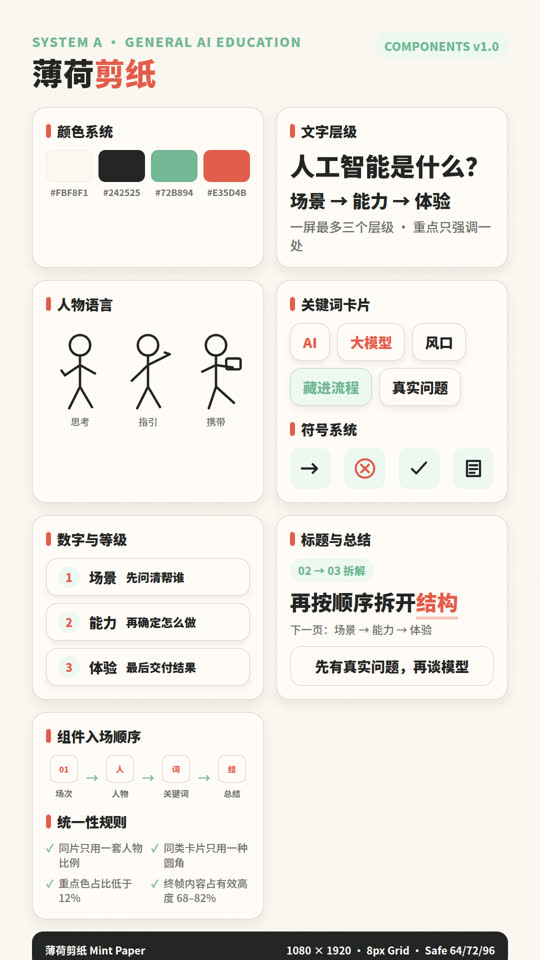
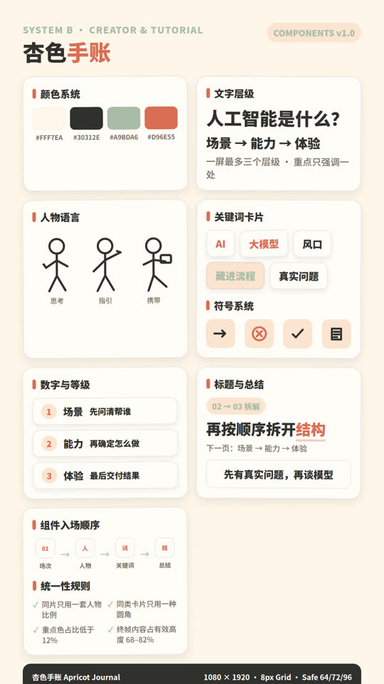
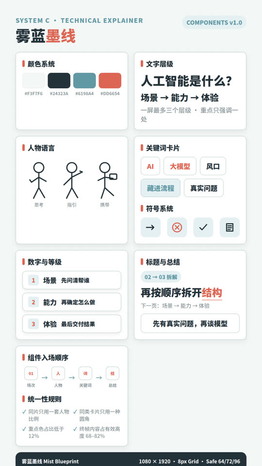
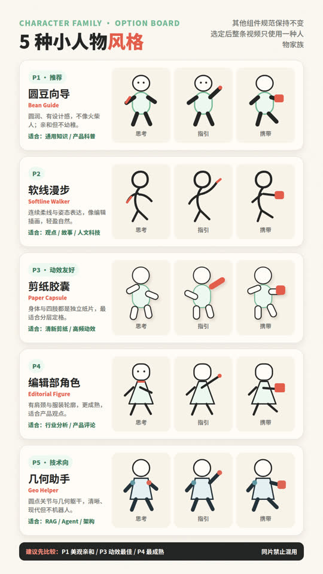

# AI 知识视频组件设计系统

完整参数规范：

`../../.cursor/skills/ai-knowledge-sketch-video/references/component-design-systems.md`

## 三套系统

### A — 薄荷剪纸 Mint Paper

适合通用 AI / 产品知识、认知误区和流程解释。当前视频推荐继续使用这一套。

### B — 杏色手账 Apricot Journal

适合创作者教育、提示词技巧、个人工作流和亲和教程。

### C — 雾蓝墨线 Mist Blueprint

适合 RAG、Agent、模型结构、对比和技术机制。

## 使用要求

1. 每条视频只选一套，不混用人物比例、圆角、阴影和图标线宽。
2. 在项目 `STYLE_LOCK.md` 写明系统名与版本。
3. 所有组件保持可独立动画。
4. 终帧内容占有效高度约 68–82%，不留无意义大空白。
5. 组件按照口播顺序出现，最后出现总结。

## 小人物风格

人物改为单独选型，不再默认使用火柴人：

- P1 圆豆向导：最美观亲和，适合通用科普
- P2 软线漫步：手绘编辑感最强
- P3 剪纸胶囊：最适合分层定格动画
- P4 编辑部角色：更成熟，适合行业/产品观点
- P5 几何助手：适合 RAG、Agent 和架构内容

完整规则：`.cursor/skills/ai-knowledge-sketch-video/references/character-styles.md`
